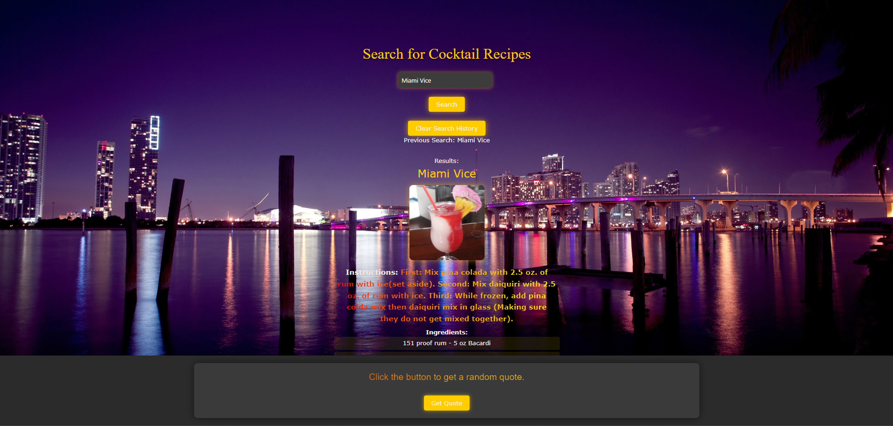

Overview

The Cocktail Recipe Finder is a web application that allows users to search for cocktail recipes by name and view detailed information including ingredients and instructions. The app also includes a feature to display a random motivational quote. All search histories are saved and can be cleared at the user’s discretion.

Features

	•	Cocktail Search: Input a cocktail name to search for recipes using the Cocktail DB API.
	•	Previous Searches: Automatically saves your last search, which is displayed when you revisit the page.
	•	Clear Search History: Option to clear previous search history from local storage.
	•	Random Quote Generator: Fetch and display a random motivational quote from the Quotes API.

Tech Stack

	•	Frontend: HTML5, CSS3 (with Bulma CSS framework), Vanilla JavaScript.
	•	API Integration: The application uses RapidAPI for accessing both the Cocktail DB API and the Quotes API.
	•	Local Storage: Stores user search history locally in the browser.

How It Works

	1.	Search for Cocktails: Enter a cocktail name in the input field and click the “Search” button. The app queries the Cocktail DB API and displays the results, including the cocktail name, image, instructions, and ingredients.
	2.	Last Search Display: The last search is saved and displayed when the page reloads.
	3.	Clear Search History: Click the “Clear Search History” button to remove stored search history.
	4.	Random Quote: Click “Get Quote” to fetch a random motivational quote, displayed in a modal.

UI Design

	•	Responsive: The app is fully responsive, making it accessible across devices.
	•	Dark Themed: The design features a dark background with vibrant accent colors for enhanced readability.
	•	Dynamic Modals: The random quote is presented using a modal, which can be opened and closed interactively.

[Live Link](URL)
	
	

Setup

	1.	Clone the repository: 
    
        bash - git clone https://github.com/your-username/cocktail-recipe-finder.git

    2.	Navigate to the project directory: 

        bash - cd cocktail-recipe-finder

    3.	Open the index.html file in your browser.

API Keys

This project requires RapidAPI keys for both the Cocktail DB and Quotes API. Update the apiKey and apiHost variables in the script.js file with your own credentials.

Javascript 

const apiKey = "your-api-key";

const apiHost = "the-cocktail-db.p.rapidapi.com";

Contributions

- Matthew Vogelsang

- Marquise Jones

- Alberto Garcia

- Gustavo Moran

License

